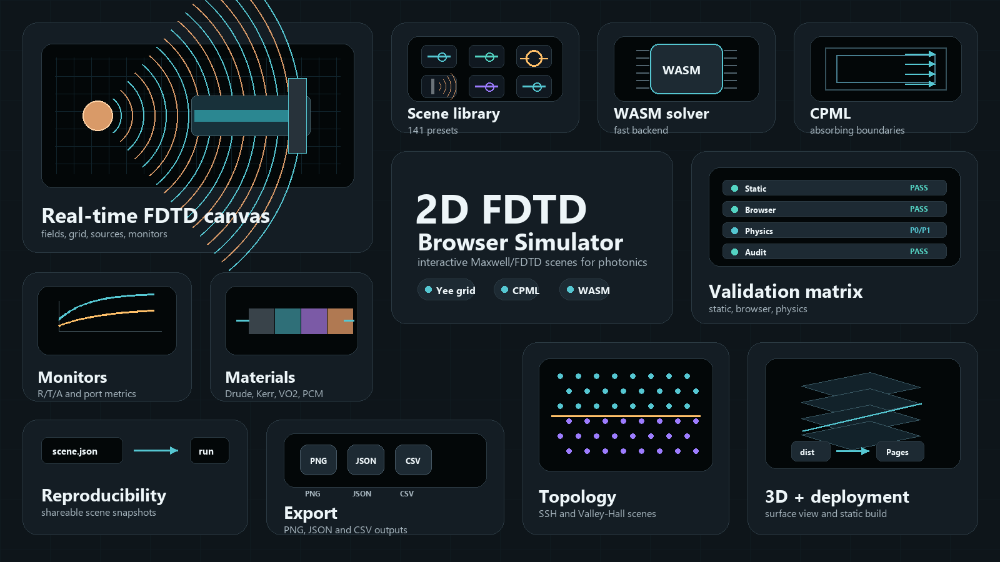

# 2D FDTD Browser Simulator

An interactive web simulator for exploring electromagnetic waves, photonics, and
Maxwell-equation intuition directly in the browser.

It is designed for teaching, rapid visual exploration, and early-stage research
prototyping: choose a scene, run the time-domain simulation, inspect fields and
observables, then export the result for discussion, reports, or reproducible
follow-up.



## Why It Exists

Electromagnetic simulation is often locked behind heavy desktop tools, long
setup steps, or black-box workflows. This simulator focuses on the opposite:
fast access, clear visual feedback, editable scenes, and enough numerical
guardrails to make the results useful for learning and exploratory work.

It is not meant to replace full commercial FEM/FDTD solvers. It is meant to make
wave physics visible.

## What You Can Explore

- Free-space propagation, interference, diffraction, and scattering.
- Normal and oblique incidence at dielectric interfaces.
- CPML absorbing boundaries and finite-domain effects.
- Waveguides, directional couplers, resonators, add-drop rings, and ringdown
  observables.
- Dispersive, conductive, anisotropic, nonlinear, phase-change, and gain/loss
  media.
- Photonic-crystal, SSH, Valley-Hall, and selected non-Hermitian/topological
  teaching examples.
- Poynting flow, field maps, line monitors, port-like metrics, sweeps, plots,
  and exported scene snapshots.

## Main Features

- Runs in a browser with no desktop simulation package.
- Includes a curated scene library with more than 100 electromagnetic and
  photonic examples.
- Provides editable sources, materials, monitors, boundaries, and numerical
  settings.
- Shows real-time field evolution with overlays, colorbars, scale references,
  and diagnostic panels.
- Supports reproducible scene export/import through JSON snapshots.
- Exports figures and data for teaching notes, reports, and notebooks.
- Uses JavaScript and WebAssembly simulation paths where available.
- Includes automated validation checks for selected reference scenes.

## Who It Is For

- Students learning wave propagation, boundary conditions, resonators, and
  photonic devices.
- Instructors preparing interactive demonstrations or visual explanations.
- Researchers sketching qualitative behavior before moving to a full solver.
- Developers experimenting with browser-based scientific visualization.

## What It Is Not

This is a 2D educational and exploratory simulator. Strong quantitative claims
still require care.

Use full validation before treating results as publication-grade:

- grid-refinement studies,
- longer runs to reduce transient effects,
- power-balance checks,
- analytical or independent numerical references,
- documented source, monitor, material, and sweep settings.

Advanced scenes should be read as reduced 2D analogues unless a specific
validation case supports the stronger physical claim.

## Run Locally

Requirements:

- Node.js on `PATH`.
- A modern browser.

Start the local server:

```powershell
npm run serve
```

Open:

```text
http://127.0.0.1:8768/index.html
```

## Validation

For a quick repository check:

```powershell
npm test
```

For browser-level checks, install Playwright once and run the smoke test:

```powershell
npm install
npx playwright install chromium
npm run test:browser
```

For the full validation protocol and current limitations, see
`docs/VALIDATION.md`.

## Deployment

The project can be published as a static GitHub Pages site. Build the deployable
artifact with:

```powershell
npm run build:pages
```

The GitHub Pages workflow publishes `dist/`.

## Further Documentation

- `docs/VALIDATION.md`: validation protocol and interpretation.
- `docs/SCENE_AUDIT.md`: scene coverage and current caveats.
- `docs/PROJECT_MAP.md`: technical map for contributors.

## License

MIT. See `LICENSE`.
