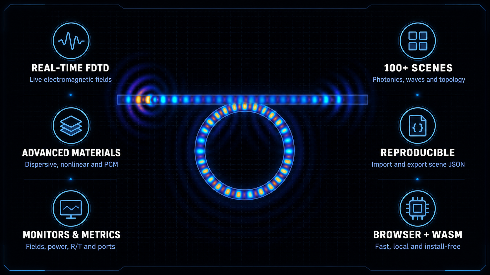

# Maxwell FDTD Lab

An interactive 2D electromagnetic teaching laboratory that runs entirely in a
modern browser. It uses finite-difference time-domain (FDTD) simulation to help
students connect Maxwell-equation concepts with visible wave behavior and
measurable device response.

The project is built for guided learning, classroom demonstrations, and
reproducible numerical exploration. Its central workflow is simple: select a
physical example, observe the relevant field or material response, inspect the
quantitative evidence, and then modify the scene to test an idea.



## Project Objective

Maxwell FDTD Lab aims to bridge four parts of electromagnetics education that
are often taught separately:

1. **Theory:** wave propagation, boundary conditions, constitutive relations,
   resonances, dispersion, and energy flow.
2. **Physical intuition:** animated fields make interference, confinement,
   coupling, scattering, and switching directly observable.
3. **Numerical method:** the simulation exposes grid resolution, FDTD time
   stepping, boundaries, sources, materials, and numerical diagnostics.
4. **Evidence:** field maps are paired with monitors, spectra, port metrics,
   sweeps, and scene-specific checks in the Results panel.

The examples are not intended as decorative animations. Each one is designed
to reveal a characteristic physical signature and, where available, provide a
quantitative observable that supports its interpretation.

## Intended Users

- Students learning electromagnetics, optics, photonics, or numerical methods.
- Instructors preparing interactive lectures, laboratory activities, or
  concept checks.
- Researchers using a lightweight 2D model for qualitative exploration before
  moving to a calibrated full-wave workflow.
- Developers studying browser-based scientific simulation and visualization.

## What You Can Study

The library contains **140 numbered examples**, plus an empty editable domain,
organized as a progressive syllabus:

- Maxwell equations, propagation, interference, and diffraction.
- Dielectric interfaces, Fresnel effects, multilayers, and Bragg structures.
- Electric and magnetic sources, arrays, radiation, and near-to-far analysis.
- Waveguides, bends, couplers, interferometers, and microwave cross sections.
- Fabry-Perot cavities, ring resonators, add-drop filters, and ringdown.
- Dielectric and metallic scattering, dimers, disorder, and localization.
- Conductive, dispersive, anisotropic, gyrotropic, and bianisotropic media.
- Photonic crystals, defect cavities, Fano resonances, and BIC analogues.
- SSH and Valley-Hall teaching models and selected topological workflows.
- Plasmonics, ENZ media, negative-index structures, metasurfaces, and hyperlenses.
- Kerr, harmonic, phase-change, gain/loss, VO2-like, and PCM-like media.
- Time-varying materials, traveling modulation, and Floquet sidebands.
- PT-symmetric, exceptional-point, non-Hermitian, and coupled advanced examples.

## Learning Workflow

1. Open **Scenes** and choose an example.
2. Read its guide to identify what should appear and which result confirms it.
3. Run or step the Yee-grid update and follow the transient behavior.
4. Compare electric or magnetic fields with `epsilon`/`mu`, material overlays,
   or Poynting flow as appropriate to the phenomenon.
5. Open **Results** for spectra, power, Q, port, switching, sideband, or sweep
   diagnostics.
6. Change one parameter at a time, repeat the run, and export the scene or data
   for comparison.

This sequence is suitable for an instructor-led demonstration, an individual
student exercise, or the first stage of a more rigorous numerical study.

## Main Capabilities

- Two-dimensional `Ez` and `Hz` FDTD formulations on a Yee grid.
- Configurable continuous-wave and pulsed sources, dipoles, mode-like launches,
  arrays, and custom monitors.
- CPML absorbing boundaries and selectable boundary conditions.
- Editable dielectric, magnetic, lossy, conductive, dispersive, tensor,
  nonlinear, active, phase-change, and time-modulated materials.
- Real-time scalar and magnitude fields, Poynting flow, vector overlays, 3D
  surface views, colorbars, and simultaneous field/material visualization.
- Scene guides, line and port diagnostics, spectra, sweeps, NTFF results, and
  device-specific observables.
- PNG figure export, CSV sweep export, and reproducible JSON scene
  export/import.
- JavaScript solver path with a WebAssembly backend where supported.
- Responsive desktop and mobile interface with no server-side simulation.

## Scientific Scope and Limitations

This is a **2D educational and exploratory solver**, not a replacement for a
validated commercial or research-grade FEM/FDTD package. Advanced scenes may
use reduced-dimensional or phenomenological models to make the governing idea
inspectable within an interactive browser simulation.

A visually plausible field pattern is not, by itself, quantitative validation.
Before using a result to support a research claim, perform at least:

- grid-refinement and time-window convergence studies,
- wavelength and smallest-feature resolution checks,
- source and monitor calibration or background-reference runs,
- energy or power-balance checks where physically applicable,
- comparison with an analytical result or an independent solver, and
- explicit documentation of units, material parameters, boundaries, and
  post-processing assumptions.

The executable validation matrix distinguishes bounded teaching checks from
stronger claims that still require calibration or convergence. See
[`docs/VALIDATION.md`](docs/VALIDATION.md) before interpreting advanced results.

## Run Locally

Requirements:

- Node.js.
- A modern browser with Canvas and WebGL support.

Start the static server:

```powershell
npm run serve
```

Then open:

```text
http://127.0.0.1:8768/index.html
```

No application build or backend service is required for normal use.

## Validation

Run the dependency-free repository checks:

```powershell
npm test
```

Install the browser-test dependency and Chromium once to run the smoke suite:

```powershell
npm install
npx playwright install chromium
npm run test:browser
```

Run the complete browser-executable physics matrix after changing presets,
material models, or observables:

```powershell
npm run test:browser:physics:all
```

The full protocol, interpretation of `PASS`/`WARN`/`BLOCK`, and current model
limitations are documented in [`docs/VALIDATION.md`](docs/VALIDATION.md).

## Deployment

The repository includes a GitHub Pages workflow. To build the same static
artifact locally:

```powershell
npm run build:pages
```

The deployable site is written to `dist/`.

## Contributor Documentation

- [`docs/PROJECT_MAP.md`](docs/PROJECT_MAP.md): canonical files and code
  ownership.
- [`docs/SCENE_AUDIT.md`](docs/SCENE_AUDIT.md): scene coverage and current
  caveats.
- [`docs/SCENE_DOCUMENTATION_AUDIT.md`](docs/SCENE_DOCUMENTATION_AUDIT.md):
  per-example guide specificity and DOI-link coverage.
- [`docs/VALIDATION.md`](docs/VALIDATION.md): numerical and physical validation
  protocol.

## Citation

If you use this software in a scientific publication, please cite the exact version used. Citation metadata are provided in [`CITATION.cff`](CITATION.cff); GitHub's **Cite this repository** menu exports them in BibTeX and APA formats.

## License

MIT. See [`LICENSE`](LICENSE).
